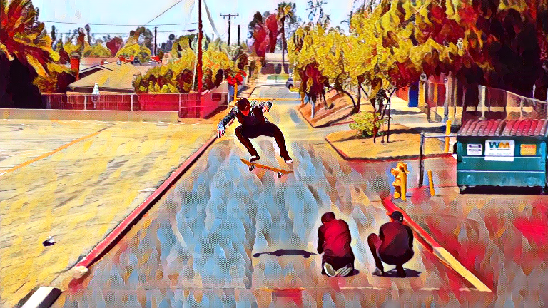

# Video style transfer with PyTorch



# Blogpost

https://thomasdougherty.github.io/pytorch-video-style-transfer/

# About

PyTorch implementation of Element AI's [Stabilizing neural style-transfer for video](https://github.com/ElementAI/chainer-fast-neuralstyle/tree/stable-style). Details can be found at my [blog](https://thomasdougherty.github.io/pytorch-video-style-transfer/).

# Getting Started

There are no extra compiled components in the repository and package dependencies are minimal,
so the code is very simple to use.
First, clone the repository locally:
```
git clone https://github.com/ThomasDougherty/pytorch-video-style-transfer.git
```
Next install the required dependencies:
```
pip install -r requirements.txt
```
## Data preparation

Download and extract COCO 2014 train and val images with annotations from
[http://cocodataset.org](http://cocodataset.org/#download).
We expect the directory structure to be the following:
```
path/to/coco/
  annotations/  # annotation json files
  train2014/    # train images
  val2014/      # val images
```

## Train

To train the model:
```
python main.py train --dataset path/to/coco/train2014/ --style-image path/to/style/style.png  --save-model-dir ./ckpt/ --cuda 1
```

## Stylize

Video frames need to be extracted into a separate folder. Frames can be stylized without GPU by setting ```--cuda``` to ```0```.
```
python main.py eval --content-dir path/to/video_frames/ --model path/to/weight.model --output-dir save/styles/here --cuda 1
```
